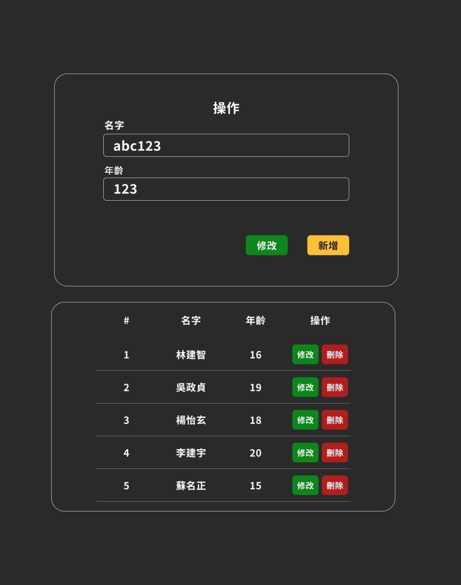

# 前端面試測試

更新日期 2024/02/06

## API

- baseUrl 將由面試官提供
- 文檔網址 ${baseUrl}/swagger/index.html

---

## 測試題目

- 請先將題目 fork 到自己的倉庫，完成後請提交整個 git 連結
- 使用 `axios` 完成對資料的 增刪改查
- 修改、新增、刪除等操作，發送請求前需與用戶進行確認
- 與用戶進行確認的畫面，請使用 dialog 標籤完成
- 用戶資料使用 `pinia` 保存
- 查找操作只能執行一次，其餘請根據 api 回傳的資料，更新畫面
- 配置 vue-i18n，繁體中文、英文
- 封裝 `按鈕`、`輸入框` 組件

---

## 組件

### 按鈕 ([EBtn.vue](components/EBtn.vue))

- hover、active 需發生樣式改變

### 輸入框 ([ETextField.vue](components/ETextField.vue))

- 需能使用 v-model:value 進行雙向綁定
- 使用 vue3.4 以下方法加分

--- 

## 設計稿



---

## 額外內容

- 請將您的專案透過自動化構建方式部屬 如(cloudflare pages、github pages、netlify、vercel 等)

## 使用

```shell
    pnpm install
    pnpm dev
```